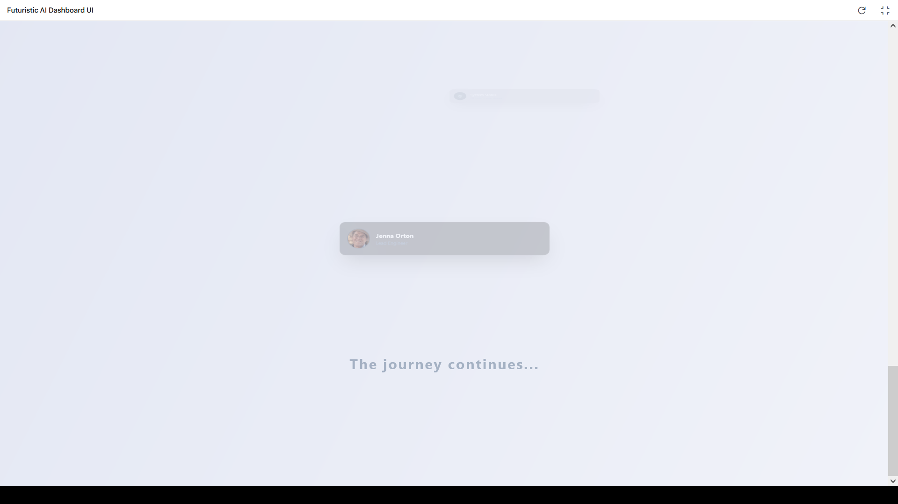
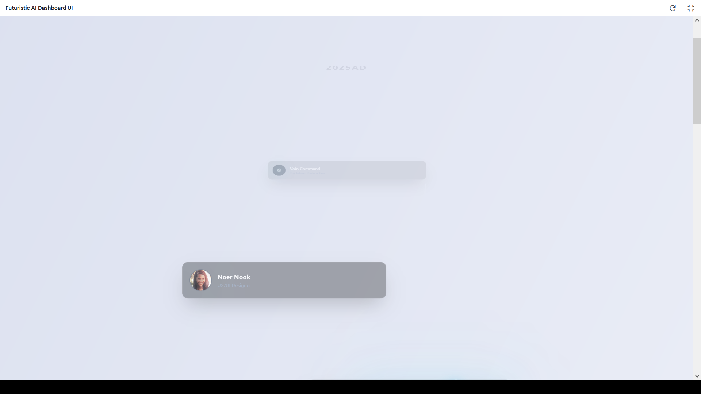

# Perspective Page - 3D Interactive UI

A modern, 3D-perspective UI showcase built with React and TypeScript. This project demonstrates an interactive user interface with animated cards, floating elements, and a 3D perspective effect.




## Features

- 3D perspective effects with CSS transforms
- Animated card components with hover effects
- Responsive design for various screen sizes
- Modern UI with gradient backgrounds and glass morphism
- Component-based architecture for easy customization

## Run Locally

**Prerequisites:** Node.js

1. Clone this repository
2. Install dependencies:
   ```
   npm install
   ```
3. Run the development server:
   ```
   npm run dev
   ```

## Project Structure

- `components/` - UI components including cards and animations
- `images/` - Project images and assets
- `App.tsx` - Main application component
- `MainBoard.tsx` - Layout for the 3D perspective cards

## Technologies Used

- React
- TypeScript
- Tailwind CSS
- Vite
